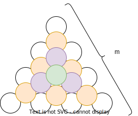
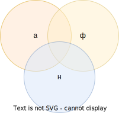

6. 

$$
C_{n+m}^n=\sum\limits_{i=0}^m C_{n+m-i-1}^{n-1}
$$

При $A = \{a_1, \ldots, a_{n+1}\}$ извлечем из этого множества все возможные $m$-сочетания с повторениями. Их $\overline{C}_{n+1}^m = C_{n+1+m-1}^m$ в силу $\overline{C}_{n}^k = C_{n+k-1}^k$, и окончательно
$$
\overline{C}_{n+1}^m = C_{n+1+m-1}^m = C_{n+m}^m=C_{n+m}^n
$$

Последнее равенство следует из $1$-го тождества.

Второй способ подсчитать $m$-сочетаний с повторениями следующий. Заметим, что в каждом $m$-сочетании с повторением есть какое-то конкретное количество объектов $a_1$. $i = 0,1,\ldots , m$, где $i$ - количество объектов $a$, входящих в данное сочетание.

Значит, число всех $m$-сочетаний с повторениями можно подсчитать как сумму $\displaystyle\sum\limits_{i=0}^m A(i)$, где $A(i)$ - количество $m$-сочетаний с повторениями, в каждом из которых ровно $i$ раз встречается $a_1$.

$A(i)$ - количество $(m-i)$-сочетаний с повторением из $\{a_2, \ldots, a_{n+1}\}$.
$$
\underbrace{a_1, \ldots, a_1}_{i-раз}\underbrace{a_x, \ldots, a_y}_{(m-i)-раз}
$$

На последних $m-i$ позициях не может быть $a_1$, а может только быть $\{a_2, \ldots, a_{n+1}\}$.

$$
A(i) = \overline{C}_n^{m-i} = C_{n+m-i-1}^{m-i} = C_{n+m-i-1}^{n-1}
$$

Приравниваем обе части и получаем
$$
C_{n+m}^n=\sum\limits_{i=0}^m C_{n+m-i-1}^{n-1} 
$$

**Следствие**

Пусть $n=1$

$$
C_{m+1}^1 = \sum\limits_{i=0}^m C_{m-i}^0
$$

$$
(m+1) = \sum\limits_{i=0}^m 1
$$

Пусть $n=2$

$$
C_{m+2}^2 = \sum\limits_{i=0}^m C_{m-i+1}^1
$$

$$
\frac{(m+2)!}{2!m!} = \frac{(m+2)(m+1)}{2}= \sum\limits_{i=0}^m (m-i+1) = (m+1) + m + (m-1) + \cdots + 2 + 1
$$

Получаем сумму арифметической прогрессии
$$
1 + 2 + \cdots + n = \frac{n(n+1)}{2}
$$

$$x = 1 + 2 + \cdots + n \\
\ \\
x = n + (n - 1) + \cdots + 1 \\
\ \\
2x = (n + 1) + (n + 1) + \cdots + (n + 1) \\
\ \\
2x = n\cdot (n + 1) \\
$$

Пусть $n=3$

$$
C_{m+3}^3 = \sum\limits_{i=0}^m C_{m-i+2}^2
$$

$$
C_{m+3}^3 = \frac{(m+3)!}{3!m!} = \frac{(m+3)(m+2)(m+1)}{6}
$$

$$
\sum\limits_{i=0}^m C_{m-i+2}^2 = C_{m+2}^2 + C_{m+1}^2 + C_{m}^2 + \cdots + C_2^2 = \\
\ \\
= \frac{(m+2)\cdot (m+1)}{2} + \frac{(m+1)\cdot m}{2} + \frac{m\cdot (m-1)}{2} + \cdots \frac{2\cdot 1}{2}
$$

Пирамида из апельсинов. В основании $\displaystyle\frac{m\cdot (m+1)}{2}$ апельсин.

Далее слой с $\displaystyle\frac{(m-1)\cdot m}{2}$ апельсинами и т.д. до $1$.

Сумма слева - это количество апельсинов, уложенных в пирамиду при длине стороны основания $m+1$.

Второй вариант использования - просуммировать квадраты натуральных чисел.

$$
\frac{(m+2)\cdot (m+1)}{2} + \frac{(m+1)\cdot m}{2} + \frac{m\cdot (m-1)}{2} + \cdots \frac{2\cdot 1}{2} = \\
\ \\
\frac{(m+1+1)\cdot (m+1)}{2} + \frac{(m+1)\cdot m}{2} + \frac{(m-1+1)\cdot (m-1)}{2} + \cdots \frac{(1+1)\cdot 1}{2} = \\
\ \\
\frac{(m+1)^2+(m+1)}{2} + \frac{m^2 + m}{2} + \frac{(m-1)^2 + (m-1)}{2} + \cdots \frac{1^2+1}{2}
$$
Получаем
$$
\frac{(m+1)^2+(m+1)}{2} + \frac{m^2 + m}{2} + \frac{(m-1)^2 + (m-1)}{2} + \cdots \frac{1^2+1}{2} = \frac{(m+3)(m+2)(m+1)}{6}
$$

$$
\frac{1}{2} \cdot\Big(1^2 + 2^2 + \cdots + (m+1)^2 + 1 + 2 + \cdots + (m+1)\Big)=\\
\ \\
\frac{1}{2} \cdot\Big(1^2 + 2^2 + \cdots + (m+1)^2 + \frac{(m+1)(m+2)}{2}\Big)
$$

$$
1^2 + 2^2 + \cdots + (m+1)^2 = \frac{(m+3)(m+2)(m+1)}{3} - \frac{(m+1)(m+2)}{2} = \\
\ \\
(m+1)(m+2)\cdot\Big(\frac{m+3}{3} - \frac{1}{2} \Big) = (m+1)(m+2)\cdot\Big(\frac{2m+6-3}{6} \Big) = \frac{(m+1)(m+2)(2m+3)}{6}
$$
Подставим вместо $m \rightarrow m-1$ 
$$
1^2 + 2^2 + \cdots + m^2 = \frac{m(m+1)(2m+1)}{6}
$$

Если брать $n=4$, то получим выражение для сумм кубов. При $n=5$ сумм 4-х степеней.

Можно показать, что
$$
1^3 + 2^3 + \cdots + m^3 = \Bigg(\frac{m(m+1)}{2}\Bigg)^2
$$
Это полный квадрат сумм арифметической прогрессии.

В левой части порядок $k$, а в правой $k+1$. Об этом можно догадаться, так как в левой части примерно половина слагаемых порядка $m^k$, и там просуммируется на $m^{k+1}$.

Можно суммы степеней подсчитать по другому.

$$
1^{10} + 2^{10} + \cdots + m^{10} = a_0 + a_1\cdot m + a_2\cdot m^2 + \cdots + a_{10}\cdot m^{10} + a_{11}\cdot m^{11}
$$

Будем последовательно подставлять значения $m$ от 1 до 12. Получим систему линейных уравнений
$$
\begin{array}{lcr}
1^{10} && = && a_0 + a_1 + \cdots + a_{11} \\
1^{10} + 2^{10} && = && a_0 + 2\cdot a_1 + 4\cdot a^2 + \cdots + 2048 \cdot a_{11} \\
1^{10} + 2^{10} + 3^{10}&& = && a_0 + 3\cdot a_1 + 9\cdot a^2 + \cdots + 3^{11} \cdot a_{11} \\
\vdots
\end{array}
$$

## Формула включение и исключений

**Пример**

Есть $N=50$ человек. Некоторые из них умеют говорить на английском (а), французcком (ф), немецком (н) языках (или на нескольких).

Известстно сколько знают английский - $N(а)$, а также французcкий и немецкий - $N(ф)$, $N(н)$. Среди тех, кто значет английский могут быть и те, кто значет французский.

Т.е. знаем $N(а,ф)$, $N(а,н)$, $N(ф,н)$.

Также известно, кто знает все три языка одновременно $N(а,ф,н)$.

Надо подсчитать количество людей, которые не знают ни один язык, т.е. $N(а',ф',н')$.

Можно воспользоваться графическим представлением

$$
N(а',ф',н') = N - N(а) - N(ф) - N(н) + N(а,ф) + N(а,н) + N(ф,н) - N(а,ф,н)
$$

Это частный случай формулы включений и исключений.

Рассмотрим общий случай.

Дано $N$ объектов $\{a_1, \ldots, a_N\}$ и свойства $\{\alpha_1, \ldots, \alpha_n\}$.

Про них известно
$$
N(\alpha_1), \ldots, N(\alpha_n): C_n^1 \\
\ \\
N(\alpha_1, \alpha_2), \ldots, N(\alpha_{n-1}, \alpha_n): C_n^2 \\
\ \\
\vdots \\
\ \\
N(\alpha_1, \ldots, \alpha_{n-1}), \ldots, N(\alpha_1,\alpha_3,\ldots, \alpha_n), N(\alpha_2, \ldots, \alpha_n): C_n^{n-1} \\
\ \\
N(\alpha_1, \ldots, \alpha_n): C_n^n
$$

**Теорема** Формула включений и исключений

$$
N(\alpha_1', \ldots, \alpha_n') = N - N(\alpha_1) - \ldots - N(\alpha_n) + N(\alpha_1, \alpha_2) +  \ldots + N(\alpha_{n-1}, \alpha_n) + (-1)^n \cdot N(\alpha_1, \ldots, \alpha_n)
$$

7.

$$
\sum\limits_{k=0}^n (-1)^k\cdot C_n^k \cdot (n-k)^m = 0
$$

Рассмотрим $A = {a_1, \ldots, a_n}$. Рассмотрим все $m$-размещения с повторением из $A$, при условии $m < n, m \not = 0$.

Их $N=n^m$.

Объектами, к которым будет применяться формула включений и исключений будут эти $N$ размещений.

Размещение обладает свойством $\alpha_i$, если $a_i$ не принадлежит ему (этому размещению).

Всего $\alpha_1, \ldots, \alpha_n$ - свойств.

Для  $m < n$, $N(\alpha_1', \ldots, \alpha_n') = 0$

Имеем
$$
N(\alpha_i) = (n-1)^m\\
\ \\
N(\alpha_i, \alpha_j) = (n-2)^m\\
\vdots \\
\ \\
N(\alpha_i, \alpha_{i+2}, \ldots, \alpha_n) = \big(n - (n-1)\big)^m = 1^m\\
\ \\
N(\alpha_1, \ldots, \alpha_n)=(n-n)^m = 0
$$

$$
C_n^0\cdot n^m - C_n^1\cdot(n-1)^m + C_n^2\cdot(n-2)^m - \cdots + (-1)^{n-1} \cdot C_n^{n-1}\cdot \big(n - (n-1)\big)^m + (-1)^n \cdot C_n^n \cdot (n-n)^m = 0
$$

$$
\sum\limits_{k=0}^n (-1)^k\cdot C_n^k \cdot (n-k)^m = 0
$$

8.

Простое знакопеременное тождество

$$
C_n^0 - C_n^1 + C_n^2 - \cdots + (-1)^nC_n^n = \Big\{
    \begin{array}{rl}
        1, && n = 0 \\
        0, && n \ge 1
    \end{array}
$$

$\square$

$$
\Big( 1 + (-1) \Big)^n = \sum\limits_{k=0}^n C_n^k y^k x^{n-k} = \sum\limits_{k=0}^n (-1)^k C_n^k
$$

$\blacksquare$