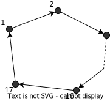
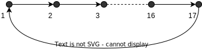
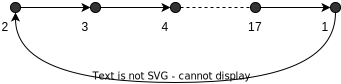
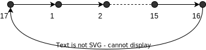
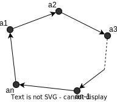

## Перечисление циклических последовательностей

**Пример**

Сколько хороводов можно составить из $17$ девушек?

Если разомкнуть цикл

Можно построить $17!$ шеренг.

Если добавить стрелку - получится хоровод

Это пример другой шеренги, но хоровод тот же.

Еще один тот же самый хоровод

Таких хороводов $\displaystyle\frac{17!}{17} = 16!$, т.е. хороводов в $17$ раз меньше, чем шеренг.

Есть множество символов $X=\{b_1, \ldots, b_r\}$ - алфавит. Хотим из символов составлять слова, т.е. символы могут повторяться.

$a_1$ - любой символ из $X$, $a_2$ - любой символ из $X$ и может совпадать с $a_1$ и т.д.

Нас интересует $T_r(n)$ - количество всех возможных циклических слов длины $n$, составленных из произвольных букв (возможно совпадающих) алфавита $X$.

Сколькими различными способами можно нарисовать цикл, в котором как угодно по вершинам расставлены символы алфавита $X$?

**Пример**

$X=\{C,O,H\}$, $r=3, n=4$

Один и тот же цикл: $COCH, OCGC,CHCO,HCOC$.

Ответ не верен: $T_3(4) \not = \frac{3^4}{4}$. Это прежде всего не целое число.

Есть слово $COCO$, которое образует цикл с $OCOC$, т.е. состоит из двух слов.

Есть слово $CССС$, которое образует цикл из одного слова - себя.

Ответ скорее всего представляет собой сумму каких-то слагаемых.

Заметим, что число элементов в цикла делит $4$, т.е. это $1, 2, 4$.

**Формула обращений Мёбиуса**

$2=2^1, 3=3^1, 4=2^2, 5=5^1, 6=2^13^1, 7=7^1, 8=2^3, 9=3^2, 10=2^15^1, 11=11^1, 12=2^23^1, \ldots$

Каждое натуральное число можно однозначно записать в виде произведения некоторых степеней различных простых чисел. И никак иначе эту запись осуществить невозможно.

Это основная теорема арифметики.

Пусть $n\in \mathbb{N}, n\ge 2$. Тогда существуют $p_1, \ldots,p_s$ - различные простые числа и существуют $k_1, \ldots, k_s \in \mathbb{N}: n = p_1^{k_1} \cdot p_2^{k_2} \times \cdots \times p_s^{k_s}$.

Более того, это разложение единственно и называется каноническим.

**Формула Мёбиуса**

Для $n\in\mathbb{N}$

$$
\mu(n)=\Bigg\{
\begin{array}{rcl}
    1, && n=1 \\
    (-1)^s, && n= p_1^{1} \cdot p_2^{1} \times \cdots \times p_s^{1}\ только\ первые\ степени\\
    0, && иначе \\
\end{array}
$$

$\mu(1)=1, 
\mu(2)=-1,
\mu(3)=-1,
\mu(4)=0,
\mu(5)=-1,
\mu(6)=1,
\mu(7)=-1,
\mu(8)=0,
\mu(9)=0,
\mu(10)=1,
\mu(11)=-1,
\mu(12)=0$

Введем обозначение $d \mid n$ - "$d$ делит $n$", $n \vdots d$ - "$n$ делится на $d$"

$\sum\limits_{d \mid n} f(d)$ - суммирование по всем делителям числа $n$

$\sum\limits_{d \mid 12} f(d) = f(1) + f(2) + f(3) + f(4) + f(6) + f(12)$

**Лемма**

Если взять 
$$
\sum\limits_{d \mid n} \mu(d) = \Bigg\{
\begin{array}{rl}
    1, && n = 1 \\
    0, && n \ge 2 \\
\end{array}
$$

**Пример**

$\sum\limits_{d \mid 2} \mu(d) = \mu(1) + \mu(2) = 1 + (-1) = 0$

$\sum\limits_{d \mid 12} \mu(d) = \mu(1) + \mu(2) + \mu(3) + \mu(4) + \mu(6) + \mu(12) = 1 + (-1) + (-1) + 0 + 1 + 0 = 0$

$\square$

Пусть $n\ge 2$. По основной теореме арифметики

$n = p_1^{k_1} \cdot p_2^{k_2} \times \cdots \times p_s^{k_s}$

$d \mid n \Rightarrow d = p_1^{l_1} \cdot p_2^{l_2} \times \cdots \times p_s^{l_s}$, где $0 \le l_1 \le k_1, \ldots, 0 \le l_s \le k_s$

**Пример**

$d \mid 12$, $12=2^23^1$, т.е. $
d = 2^23^1 = 12,
d = 2^13^1 = 6,
d = 2^03^1 = 3,
d = 2^23^0 = 4,
d = 2^13^0 = 2,
d = 2^03^0 = 1,
$

$\mu(d) = 0$, если хотя бы одно $l_1 \ge 2$. Это следует из определения функции Мёбиуса. Т.е. никакие $\mu(d)$ такого вида не дают вклада в сумму $\sum\limits_{d \mid n} \mu(d)$.

Таким образом нас интересуют только слагаемые, в которых каждое $l_i$ либо $0$, либо $1$.

А таких слагаемых всего $2^s$.

Среди этих слагаемых есть те, у которых $l_1 = 1$, а остальные $l_i = 0$. Тогда $\mu(d)=-1$, т.к. имеем простое число, а если $l_2=1$, а остальные $l_i=0$, то также $\mu(d) = -1$.

Если одна $1$, а остальные $0$, то $\mu(d) = -1$.

Если две $1$, а остальные $0$, то $\mu(d) = 1$.

Если три $1$, а остальные $0$, то $\mu(d) = -1$.

Итого получаем
$$
\sum\limits_{d \mid n} \mu(d) = \mu(1) + s(-1)^1+C_s^2(-1)^2+C_s^3(-1)^3 + \cdots + C_s^s(-1)^s
$$

Рассмотрим слагаемые 

$\mu(1) = C_s^0(-1)^0$

$s(-1)^1$ - где $s$ - это $s$ способов взять одну $1$ и $s-1$ нулей в последовательности $l_1, \ldots, l_s$, а $(-1)^1$ - это $\mu(p_i^1)$

$C_s^2(-1)^2$ - $C_s^2$ - взять две $1$ и $s-2$ нуля в последовательности $l_1, \ldots, l_s$, а $(-1)^2$ - это $\mu(p_i^1p_j^1)$

Окончательно

$$
\sum\limits_{d \mid n} \mu(d) = C_s^0 - C_s^1 + C_s^2- \cdots + (-1)^sC_s^s
$$

Знакопеременное тождество. При $s\ge 1$
$$
C_s^0 - C_s^1 + C_s^2- \cdots + (-1)^sC_s^s = 0
$$

$\blacksquare$

**Теорема** Формула обращения Мёбиуса

Пусть есть функция $g(n)$ - натурального аргумента $n\in \mathbb{N}$. Пусть $f(n)$ новая функция $f(n) = \sum\limits_{d \mid n} g(d)$.

Тогда

$$
g(n) = \sum\limits_{d \mid n} \mu(d)\cdot f\bigg(\frac{n}{d}\bigg)
$$

В чем состоит обобщение?

Есть формула, которая (по определению) выражает $f()$ как сумму значений $g()$, а мы обоьщаем ее в том смысле, что записываем $g()$ как функцию через $f()$ и функцию Мёбиуса.